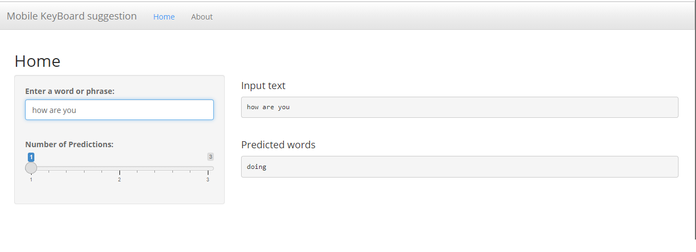

```{r setup, include=FALSE}
knitr::opts_chunk$set(echo = FALSE)
```

## Mobile KeyBoard suggestion

25 September 2022

 Coursera Data Science Specialization
 Capstone Project
 Johns Hopkins University
 

## Business Problem

This presentation aim to develop a next word predixtion that will be applied to smartphone's keyboard.

The Mobile KeyBoard suggestion app is available for testing at:

+ https://arcaici.shinyapps.io/KeybordPredictionApp/


## Application Type and Logic
 
Mobile KeyBoard suggestion is a shiny app made from R that use words wrotes from a user for predict the next word that him/her will type.
 
THe algorith will suggest the next word in a sentence using a n-gram algorith, where a n-gram algorithm is a contiguous sequence of n words from a given sequence of text.

The dataset is made from different files of text, they were collected over blogs, news, and twitter. N-grams were extracted from the corpus and then used to build the predictive text model.


## Predictive Model

The predictive text model was built from a sample of 800,000 lines extracted from the corpusa.

The sample data was then tokenized and cleaned using the tm package and a number of regular expressions using the gsub function. As part of the cleaning process the data was converted to lowercase, removed all non-ascii characters, URLs, email addresses, Twitter handles, hash tags, ordinal numbers, profane words, punctuation and whitespace. The data was then split into tokens (n-grams).

As text is entered by the user, the algorithm iterates from longest n-gram (4-gram) to shortest (2-gram) to detect a match. The predicted next word is considered using the longest, most frequent matching n-gram. The algorithm makes use of a simple back-off strategy.


## Application User Interface

The predicted next word will be shown when the app detects that you have finished typing one or more words. When entering text, please allow a few seconds for the output to appear. Use the slider tool to select up to three next word predictions. The top prediction will be shown first followed by the second and third likely next words.

```{r, echo=FALSE}
  
```