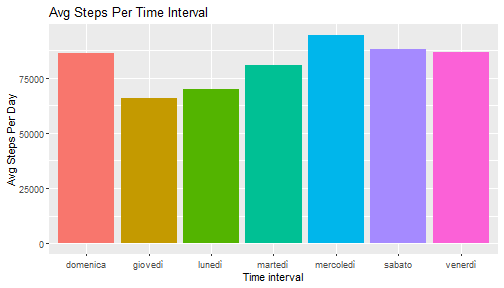
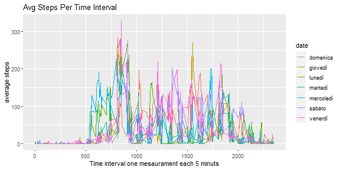
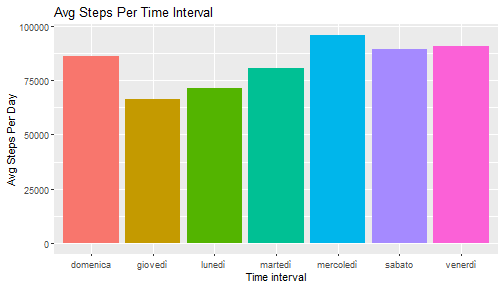
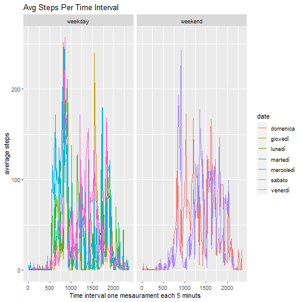

##Course Project week 1##  

###Looking in to data###  

This data set contain  information about about personal movement using activity monitoring devices such as a Fitbit,   Nike Fuelband, or Jawbone Up.    

**loading data**  


```r
library(ggplot2)

data <- read.csv("./data/activity.csv")

summary(data)
```

```
##      steps            date              interval     
##  Min.   :  0.00   Length:17568       Min.   :   0.0  
##  1st Qu.:  0.00   Class :character   1st Qu.: 588.8  
##  Median :  0.00   Mode  :character   Median :1177.5  
##  Mean   : 37.38                      Mean   :1177.5  
##  3rd Qu.: 12.00                      3rd Qu.:1766.2  
##  Max.   :806.00                      Max.   :2355.0  
##  NA's   :2304
```

*Steps* has alot of NA values, about 2304, while *date* is not in date format.  Let's change *date* format and leave   NA values for now   

**data processing**  

```r
data$date <- as.Date(data$date, "%Y-%m-%d")

head(data,5)
```

```
##   steps       date interval
## 1    NA 2012-10-01        0
## 2    NA 2012-10-01        5
## 3    NA 2012-10-01       10
## 4    NA 2012-10-01       15
## 5    NA 2012-10-01       20
```


###What is mean total number of steps taken per day###  

First it need to be calculate  the total number of steps per day(*step_day*).  


**steps per day**  

```r
step_day <- aggregate(steps ~ weekdays(date) , data, sum)

head(step_day, 5)
```

```
##   weekdays(date) steps
## 1       domenica 85944
## 2        giovedì 65702
## 3         lunedì 69824
## 4        martedì 80546
## 5      mercoledì 94326
```


let's plot the histogram about *step_day*  

**histogram**  

```r
ggplot(step_day, aes(x =`weekdays(date)`, y = steps)) +
  geom_bar(stat = "identity",aes( fill = factor(`weekdays(date)`))) +
  ggtitle("Avg Steps Per Time Interval") +
  labs(x="Time interval", y="Avg Steps Per Day") +
  guides(fill = "none")
```


how much are *mean* and *median* of the total number of *steps* taken per day?  

**mean and median**  


```r
print(mean(step_day$steps))   #mean
```

```
## [1] 81515.43
```

```r
print(median(step_day$step))  #median
```

```
## [1] 85944
```

###What is the average daily activity pattern?###  

**average number of steps taken all days across interval**

```r
step_5_min <- data
step_5_min$date <- weekdays(data$date)
head(step_5_min)
```

```
##   steps   date interval
## 1    NA lunedì        0
## 2    NA lunedì        5
## 3    NA lunedì       10
## 4    NA lunedì       15
## 5    NA lunedì       20
## 6    NA lunedì       25
```

```r
step_5_min <- aggregate(steps ~ date + interval , step_5_min, mean)
head(step_5_min)
```

```
##        date interval    steps
## 1  domenica        0 0.000000
## 2   giovedì        0 5.875000
## 3    lunedì        0 1.428571
## 4   martedì        0 0.000000
## 5 mercoledì        0 4.250000
## 6    sabato        0 0.000000
```


**Line graph: average number of steps taken all days**

```r
ggplot(step_5_min, aes(x=interval, y = steps, color= date)) +
  geom_line() + 
  ggtitle("Avg Steps Per Time Interval") + 
  labs(x="Time interval one mesaurament each 5 minuts", y="average steps")
```



**5-minute interval on average across all the days that contains the maximum number of steps?**  

```r
max(step_5_min$step)
```

```
## [1] 328.5714
```

###Imputing missing values###  

**Number of missing values**

```r
na <- is.na(data)
nrow(data[na,])
```

```
## [1] 2304
```

**function for fill missing value in steps**


```r
fillStepBydayMean <- function(row, step_day) {
  
  row[,1] <-  step_day[step_day$day == row[,2], 1 ]
  
  return(row)
  
}
```

**filling missing data**

```r
colnames(step_day) <- c("day", "steps")

step_day$day <- factor(step_day$day)

fill_data <- data
fill_data$date <- factor(weekdays(as.Date(fill_data$date, "%Y-%m-%d")))

na_steps <- which(is.na(fill_data$steps))

i<-1L


for(index in na_steps) {
  fill_data[index, ] <- fillStepBydayMean(fill_data[index,], step_day )
}
```


```r
summary(fill_data)
```

```
##      steps               date         interval     
##  Min.   :  0.00   domenica :2304   Min.   :   0.0  
##  1st Qu.:  0.00   giovedì  :2592   1st Qu.: 588.8  
##  Median :  0.00   lunedì   :2592   Median :1177.5  
##  Mean   : 33.04   martedì  :2592   Mean   :1177.5  
##  3rd Qu.:  7.00   mercoledì:2592   3rd Qu.:1766.2  
##  Max.   :806.00   sabato   :2304   Max.   :2355.0  
##                   venerdì  :2592
```

```r
head(fill_data)
```

```
##   steps   date interval
## 1     3 lunedì        0
## 2     3 lunedì        5
## 3     3 lunedì       10
## 4     3 lunedì       15
## 5     3 lunedì       20
## 6     3 lunedì       25
```


```r
step_day_filled_na <- aggregate(steps ~ date , fill_data, sum)


ggplot(step_day_filled_na, aes(x =date, y = steps)) +
  geom_bar(stat = "identity",aes( fill = date)) +
  ggtitle("Avg Steps Per Time Interval") +
  labs(x="Time interval", y="Avg Steps Per Day") +
  guides(fill = "none")
```



**mean and median fill_data**

```r
print(mean(step_day_filled_na$steps))   #mean
```

```
## [1] 82914.29
```

```r
print(median(step_day_filled_na$step))  #median
```

```
## [1] 86232
```


###Are there differences in activity patterns between weekdays and weekends? ###


**Create a new factor variable in the data set with two levels – “weekday” and “weekend” indicating whether a given date is a weekday or weekend day.**


```r
fill_data$date <- weekdays(as.Date(data$date, "%Y-%m-%d"))
fill_data$weektype <- sapply(fill_data$date, function(x){
  if(x == "domenica" | x=="sabato" | x == "sunday"| x == "saturday"){
    result <- "weekend"
  }else{
    result <- "weekday"
  }
  
  return(result)
})

head(fill_data,5)
```

```
##   steps   date interval weektype
## 1     3 lunedì        0  weekday
## 2     3 lunedì        5  weekday
## 3     3 lunedì       10  weekday
## 4     3 lunedì       15  weekday
## 5     3 lunedì       20  weekday
```


```r
step_5_min_filled <- fill_data
step_5_min_filled <- aggregate(steps ~ date + interval + weektype , step_5_min_filled, mean)
head(step_5_min_filled)
```

```
##        date interval weektype     steps
## 1   giovedì        0  weekday 5.4444444
## 2    lunedì        0  weekday 1.7777778
## 3   martedì        0  weekday 0.0000000
## 4 mercoledì        0  weekday 4.3333333
## 5   venerdì        0  weekday 1.5555556
## 6   giovedì        5  weekday 0.2222222
```

```r
ggplot(step_5_min_filled, aes(x=interval, y = steps, color= date)) +
  geom_line() +
  facet_grid(.~ weektype) +
  ggtitle("Avg Steps Per Time Interval") + 
  labs(x="Time interval one mesaurament each 5 minuts", y="average steps")
```


